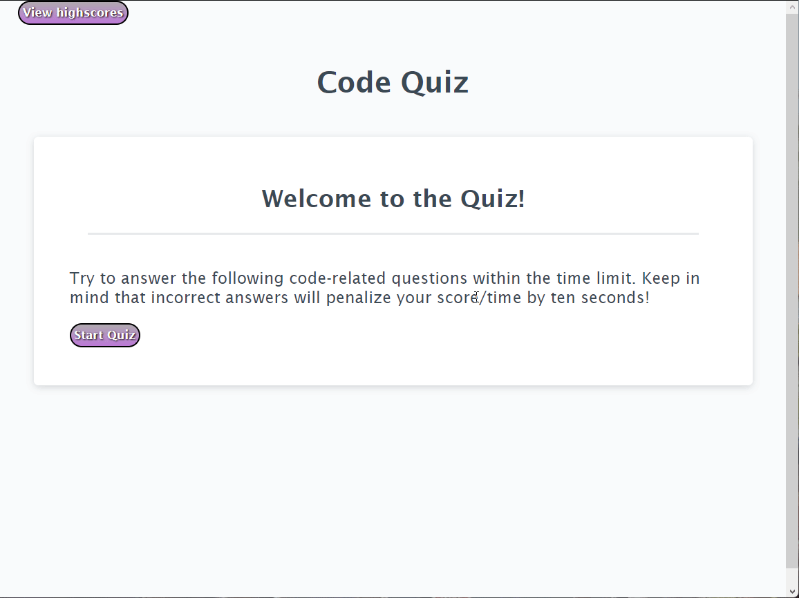

# **CODE QUIZ**

## **This project was created in order to take a quiz about JavaScript fundamentals, allowing the users to store scores, organising them in a high scores list.**
 
* HTML, CSS and JavaScript was build from scratch.
* On the welcome page a button is displayed to start the quiz and another to view the high scores. 
* When the user presses the start button, the timer starts and the first question is shown. 
* If the user answers correctly, the following question is presented, otherwise 10 seconds are taken from the timer before being presented with the following question.
* When the user finishes the quiz the time left is the  user's score.
* The quiz is over when the timer reaches 0 or the user answers all the questions.
* The final page displays the option to save the score by typing the user's initials.
* User can press the button to see the higscores list or press the button to go back to the welcome page.   

💡 See live version here: [https://marcelamejiao.github.io/Code-Quiz/](https://marcelamejiao.github.io/Code-Quiz/)

### **Preview**

